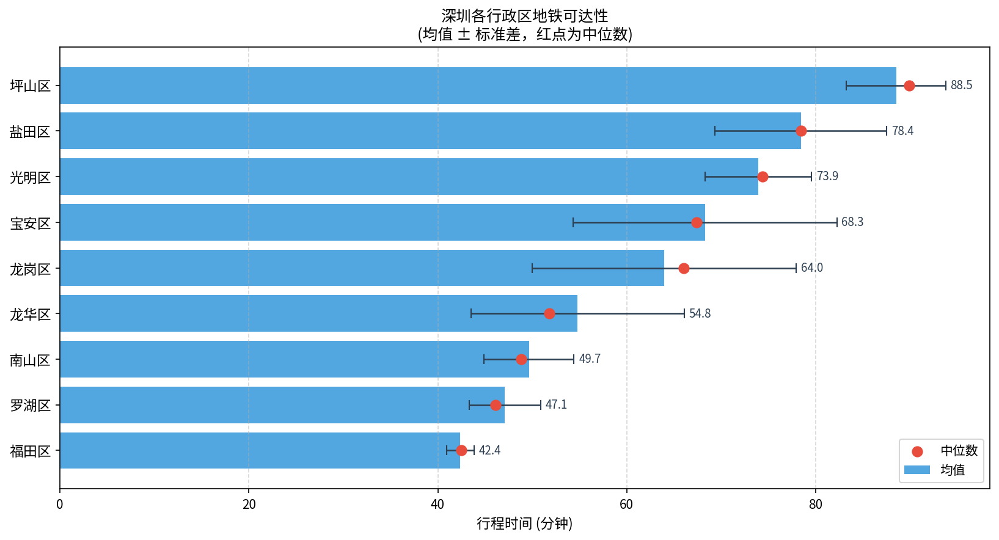
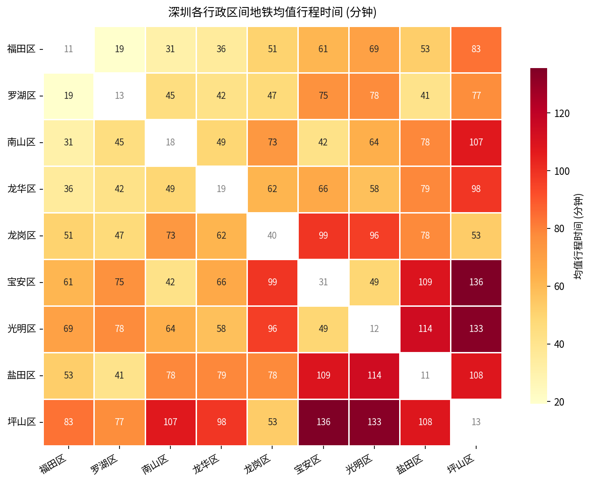
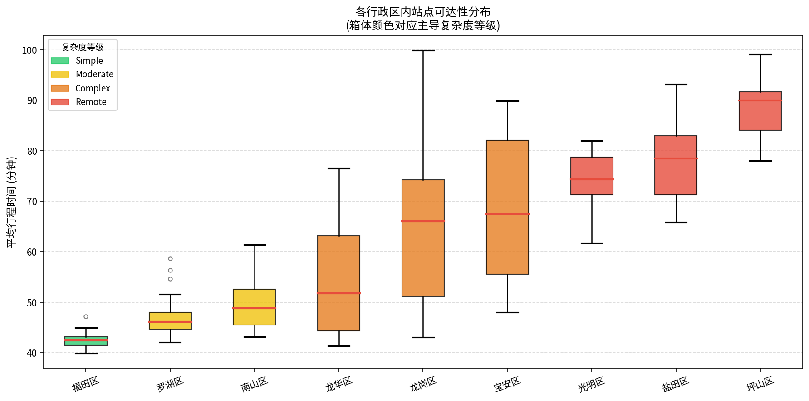
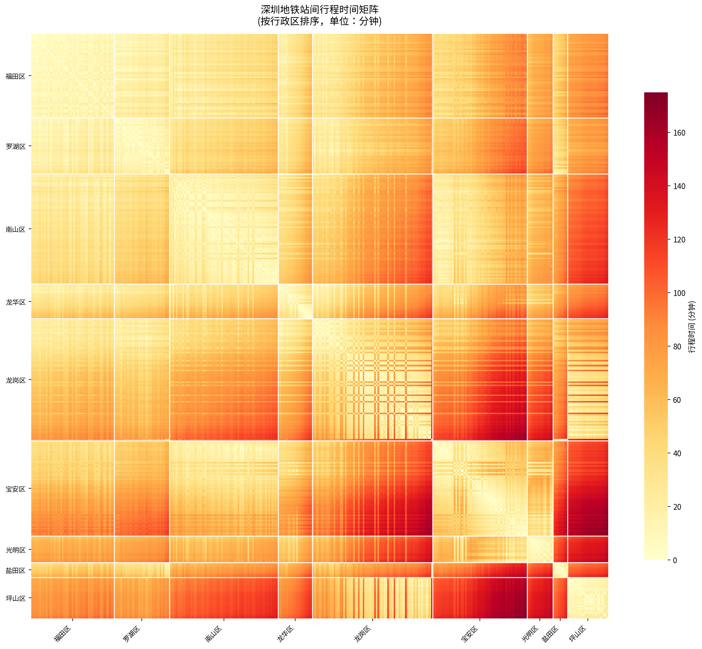

# SZ-Metro-Metrics Analysis

深圳地铁可达性分析管道——从数据爬取到可视化的完整数据工程项目。

## 项目概述

本项目通过构建深圳地铁网络图，计算全站点间最短行程时间矩阵，并按行政区聚合可达性指标，量化分析深圳各区的地铁出行复杂度。

**数据规模**（2024年）：17条线路 · 355个站点 · 830条有向边 · 9个行政区

## 分析结果

### 行政区可达性排名

| 排名 | 行政区 | 均值行程时间 | 复杂度等级 |
|:---:|--------|:-----------:|:-------:|
| 1 | 福田区 | 42.4 分钟 | Simple |
| 2 | 罗湖区 | 47.1 分钟 | Simple |
| 3 | 南山区 | 49.7 分钟 | Moderate |
| 4 | 龙华区 | 54.8 分钟 | Moderate |
| 5 | 龙岗区 | 64.0 分钟 | Complex |
| 6 | 宝安区 | 68.3 分钟 | Complex |
| 7 | 光明区 | 73.9 分钟 | Remote |
| 8 | 盐田区 | 78.4 分钟 | Remote |
| 9 | 坪山区 | 88.5 分钟 | Remote |

### 可视化图表

| 图表 | 说明 |
|------|------|
|  | 各区可达性均值 ± 标准差 |
|  | 区对区均值行程时间热力图 |
|  | 各区站点分布箱形图 |
|  | 355×355 站间行程时间矩阵 |

## 系统架构

```
数据爬取        图构建          聚合分析         可视化
─────────      ──────────      ──────────      ──────────
Amap API   →   NetworkX    →   行政区归属   →   热力图
坐标估算        Dijkstra        可达性指标       柱/箱状图
Nominatim      换乘惩罚        复杂度分级       散点图
```

### 四模块流水线

```
python -m src.scraper      # 爬取站点与路段数据
python -m src.engine       # 构建图，计算全对最短路径
python -m src.aggregator   # 行政区聚合与复杂度分级
python -m src.viz          # 生成所有可视化图表
```

## 项目结构

```
.
├── src/
│   ├── scraper/          # 数据爬取模块
│   │   ├── client.py     # 异步 HTTP 客户端（指数退避重试）
│   │   ├── fetcher.py    # Amap 地铁接口请求
│   │   ├── parser.py     # 响应解析 + 哈弗辛行程时间估算
│   │   ├── models.py     # Pydantic 数据模型
│   │   └── pipeline.py   # 主流程编排
│   ├── engine/           # 图计算模块
│   │   ├── graph.py      # NetworkX 图构建（路段边 + 换乘惩罚边）
│   │   ├── solver.py     # 全对 Dijkstra 最短路径矩阵
│   │   └── pipeline.py   # 主流程编排
│   ├── aggregator/       # 聚合分析模块
│   │   ├── geocode.py    # Nominatim 反向地理编码（GCJ-02→WGS-84）
│   │   ├── classifier.py # 坐标推断行政区（兜底）
│   │   ├── metrics.py    # 可达性指标 + 复杂度分级
│   │   └── pipeline.py   # 主流程编排
│   └── viz/              # 可视化模块
│       ├── heatmap.py    # 站间/区间热力图
│       ├── district_chart.py  # 柱状图、箱形图、散点图
│       └── pipeline.py   # 主流程编排
├── data/
│   ├── raw/
│   │   ├── stations.csv          # 爬取的站点数据
│   │   ├── segments.csv          # 路段行程时间
│   │   ├── station_districts.csv # Nominatim 地理编码缓存
│   │   └── manual_transfers.csv  # 手动配置的跨网换乘（云巴↔地铁）
│   ├── processed/                # 引擎与聚合器输出（运行后生成）
│   └── figures/                  # 可视化图表
├── requirements.txt
└── .env                          # 环境变量（不含 token，本地配置）
```

## 快速开始

### 1. 安装依赖

```bash
pip install -r requirements.txt
```

### 2. 配置环境变量（可选）

在项目根目录创建 `.env`：

```env
# 高德地图（无需 Key 即可爬取站点拓扑）
AMAP_SUBWAY_URL=https://map.amap.com/service/subway
SZ_METRO_CITY_CODE=4403
SZ_METRO_CITY_NAME=shenzhen

# 可选：提供 Key 可获取精确路段行程时间（否则使用坐标估算）
# 在 https://lbs.amap.com/dev/ 免费申请
AMAP_API_KEY=
```

### 3. 运行完整管道

```bash
# 方式一：逐步运行（推荐，可单独检查每步输出）
python -m src.scraper      # ~2 秒，输出 data/raw/
python -m src.engine       # ~1 秒，输出 data/processed/
python -m src.aggregator   # ~7 分钟（首次 Nominatim 编码），输出 data/processed/
python -m src.viz          # ~5 秒，输出 data/figures/
```

> **注**：`src.aggregator` 首次运行时会通过 Nominatim（OpenStreetMap）对全部 355 个站点进行反向地理编码，限速 1 次/秒，约需 6-7 分钟。结果缓存至 `data/raw/station_districts.csv`，后续运行立即完成。

### 4. 在代码中调用

```python
from src.scraper.pipeline import run as scrape
from src.engine.pipeline import run as build_engine
from src.aggregator.pipeline import run as aggregate
from src.viz.pipeline import run as visualize

data = asyncio.run(scrape())
graph, matrix = build_engine()
results = aggregate()
visualize()
```

## 技术设计

### 数据来源

| 数据 | 来源 | 认证 |
|------|------|------|
| 站点拓扑（名称、坐标、换乘） | [高德地图地铁接口](https://map.amap.com/service/subway) | 无需 Key |
| 路段行程时间 | 站点坐标哈弗辛估算（35 km/h）/ 高德路径规划 API | 可选 Key |
| 行政区归属 | [Nominatim](https://nominatim.openstreetmap.org/)（GCJ-02→WGS-84 转换） | 无需 Key |

### 图模型

- **节点**：每个唯一 `station_id` 对应一个节点（355个）
- **路段边**：相邻站点间有向边，权重为行程时间（分钟）
- **换乘边**：同名不同 ID 的换乘站之间，默认惩罚 **4 分钟**
- **手动换乘边**：坪山云巴 ↔ 主网地铁接驳点（3 对，默认 **5 分钟**）

| 云巴站 | 接驳站 | 所属线路 |
|--------|--------|---------|
| 坪山高铁站 | 坪山 | 16号线 |
| 龙背 | 东纵纪念馆 | 16号线 |
| 坪山中心(云巴) | 坪山中心 | 14号线 |

### 复杂度分级

基于各站点平均行程时间的四分位阈值（Q1/Q2/Q3）划分：

| 等级 | 定义 | 阈值 |
|------|------|------|
| Simple | ≤ Q1，最易到达 | ≤ 45.2 分钟 |
| Moderate | Q1–Q2 | 45.2–53.1 分钟 |
| Complex | Q2–Q3 | 53.1–72.7 分钟 |
| Remote | > Q3，最难到达 | > 72.7 分钟 |

## 依赖

```
pandas · numpy · networkx · httpx · pydantic
python-dotenv · tqdm · matplotlib · seaborn
playwright (可选，用于未来 JS 渲染页面爬取)
geopandas (可选，用于地图叠加)
```

## 扩展性

- **公交/高铁接入**：通过 `ExtraEdge` 接口向图中注入任意加权边，无需修改引擎代码
- **其他城市**：修改 `.env` 中的 `SZ_METRO_CITY_CODE` 和 `SZ_METRO_CITY_NAME` 即可切换城市
- **精确行程时间**：配置 `AMAP_API_KEY` 后重新运行 `src.scraper` 即可替换估算值
- **手动区域修正**：编辑 `data/raw/station_districts.csv` 覆盖 Nominatim 的行政区归属结果
